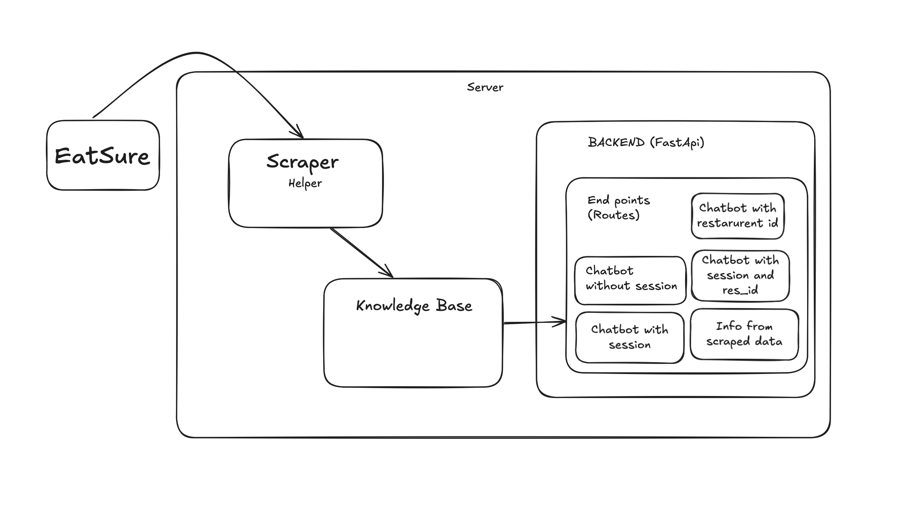

# Restaurant RAG Chatbot Architecture

## Overview

The Zomato Restaurant RAG Chatbot is designed to provide users with information about restaurants, their menus, and features using a Retrieval-Augmented Generation (RAG) approach. The architecture consists of several components that work together to scrape restaurant data, process it into a knowledge base, and serve it through a FastAPI backend.

## Project Structure

The project is organized into several directories and files, each serving a specific purpose:

### Directory Structure

- **.github/**: Contains GitHub Actions workflows for CI/CD.
  - **workflows/**: Contains workflow files for automated deployment.

- **assets/**: Contains static assets for the frontend.

- **data/**: Contains directories for raw and processed data.
  - **raw/**: Raw scraped data.
  - **processed/**: Processed data ready for use.

- **frontend/**: Vite+React frontend for the chatbot interface. 

- **logs/**: Directory for log files generated by the application.

- **models/**: Contains model files, including indices for the knowledge base.
  - **index/**: Directory for storing the index files.

- **notebooks/**: Jupyter notebooks for data exploration and model evaluation.
  - **restaurant.ipynb**: Notebook for exploring the restaurant dataset.

- **src/**: Contains the source code for the application.
  - **api/**: Contains the FastAPI backend implementation.
    - **backend.py**: Main API server file.
    - **static/**: Contains static files for the frontend.
      - **index.html**: Main HTML file for the web interface.
      - **assets/**: Contains CSS and JavaScript files.
  - **chatbot/**: Contains the chatbot logic.
    - **chatbot.py**: Main chatbot class.
    - **conversation.py**: Manages conversation history.
    - **generator.py**: Handles response generation using AI.
    - **retriever.py**: Retrieves relevant information from the knowledge base.
  - **knowledge_base/**: Contains logic for managing the restaurant knowledge base.
    - **indexer.py**: Indexes restaurant data for efficient retrieval.
    - **processor.py**: Processes raw data into a structured format.
  - **scraper/**: Contains web scraping logic.
    - **helper.py**: Utility functions for cleaning and processing scraped data.
    - **scraper.py**: Main scraping class.
  - **utils/**: Contains utility functions and custom exceptions.
    - **exceptions.py**: Custom exception classes.
    - **logger.py**: Logging configuration.

- **/ARCHITECTURE.md**: This file, providing an overview of the architecture.

- **config.py**: Configuration settings for the application.

- **docker-compose.yml**: Docker Compose file for orchestrating multi-container applications.

- **Dockerfile**: Dockerfile for containerizing the application.

- **main.py**: Entry point for the application, orchestrating the scraping and knowledge base building.

- **/pyproject.toml**: Configuration file for the project.

- **README.md**: Overview and instructions for the project.

- **requirements.txt**: Lists the dependencies required for the project.

- **SETUP.md**: Instructions for setting up the development environment.

## Architecture Diagram

## Components Description

### API

- **backend.py**: Sets up the FastAPI server, handles incoming requests, and serves static files. It defines endpoints for chatting with the bot and retrieving restaurant information.

### Chatbot

- **chatbot.py**: Implements the main chatbot logic, integrating the retriever and generator components.
- **conversation.py**: Manages the conversation history for each user session.
- **generator.py**: Uses AI to generate responses based on retrieved information.
- **retriever.py**: Retrieves relevant documents from the knowledge base based on user queries.

### Knowledge Base

- **indexer.py**: Creates an index for quick lookups of restaurant data.
- **processor.py**: Processes raw data into a structured format suitable for the knowledge base.

### Scraper

- **scraper.py**: Contains the logic for scraping restaurant data from specified URLs.
- **helper.py**: Provides utility functions for cleaning and processing scraped data.

### Utilities

- **exceptions.py**: Defines custom exceptions for error handling.
- **logger.py**: Configures logging for the application.

## Conclusion

The Zomato Restaurant RAG Chatbot is a modular and extensible application that leverages web scraping, AI, and a structured knowledge base to provide users with accurate and relevant restaurant information. The architecture is designed to be user-friendly and maintainable, allowing for easy updates and enhancements in the future.
