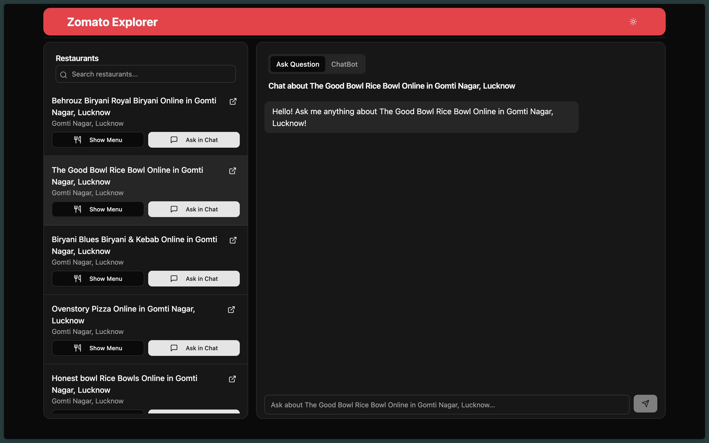
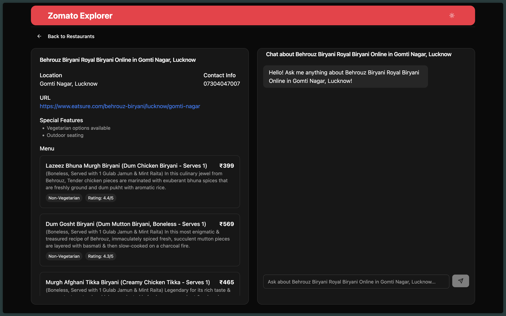

# Restaurant-Scraper-Rag-Bot

## Overview

This repository is a web scraping and data processing project that collects restaurant data from various sources, builds a knowledge base, and provides a user-friendly interface for querying the data. The project is built using Python, FastAPI, and React.

## Features

- Web scraping of restaurant data
- Knowledge base construction
- FastAPI backend for serving data
- React frontend for user interaction
- Data visualization and analysis
- Docker support for easy deployment
- Data processing and storage
- Logging and error handling
- Configuration management

## Setup Guide

[SETUP.md](SETUP.md) provides a detailed setup guide for the project, including instructions for installing dependencies, configuring the environment, and running the application.

## Architecture

[ARCHITECTURE.md](ARCHITECTURE.md) provides an overview of the system architecture, including the data flow, components, and interactions between different parts of the application.

## Live Demo and Functionality

### Ask Questions

In this section you can ask any questions related to the restaurant data. The chatbot will respond with relevant information based on the knowledge base. You can also compare prices, check weather it is gultan free, and get other information about the restaurant.

### ChatBot

In this section you can chat with the chatbot using websockets and session management. The chatbot will remember the context of the conversation and provide relevant responses based on the knowledge base.

### Ask Questions to one Restaurant only

In this section you can ask questions related to a specific restaurant. The chatbot will respond with relevant information based on the knowledge base. You can also compare prices, check weather it is gultan free, and get other information about the restaurant.

### ChatBot to one Restaurant only

In this section you can chat with the chatbot using websockets and session management. The chatbot will remember the context of the conversation and provide relevant responses based on the knowledge base.

### View menu

You can also view the menu of a specific restaurant to get more information about the dishes and prices. The menu is displayed in a user-friendly format with images and descriptions.

### View restaurant details

To get more information about a specific restaurant, you can view the details such as address, phone number, and website. The details are displayed in a user-friendly format with images and descriptions.

## Contributing

Contributions are welcome! If you have any suggestions or improvements, please feel free to open an issue or submit a pull request. 
Follow all the guidelines provide by GitHub for contributing to this project.

## License

This project is licensed under the MIT License. See the [LICENSE](LICENSE) file for details.

## Acknowledgements

This project was inspired by the need for a comprehensive restaurant data scraping and analysis tool. Special thanks to the open-source community for their contributions and support.

## Contact

For any inquiries or feedback, please contact the project maintainer at [prashantyadav.site](https://prashantyadav.site).

## Author

- [Prashant Yadav](https://github.com/0PrashantYadav0)
- [LinkedIn](https://www.linkedin.com/in/prashantyadav097/)
